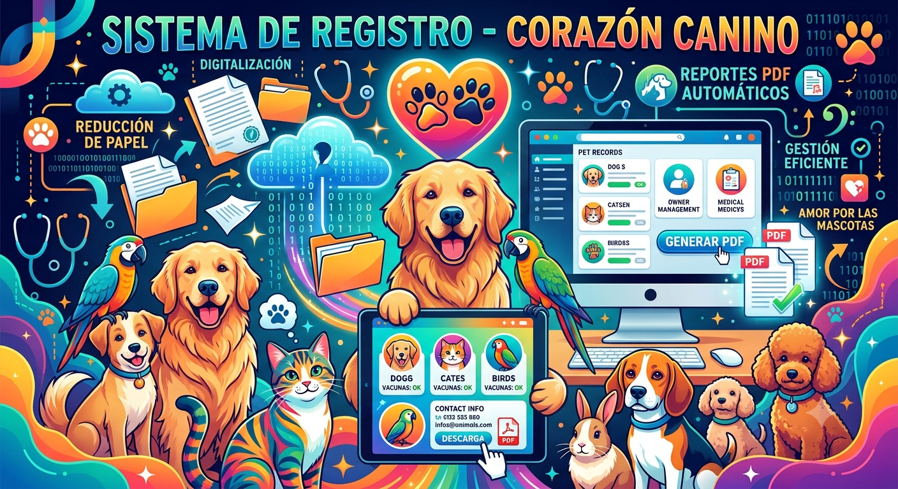

# 🐾 Sistema de Registro de Mascotas y Propietarios - Veterinaria Corazón Canino

¡Bienvenido al repositorio del proyecto desarrollado durante mis estancias universitarias para la **Veterinaria Corazón Canino**! Este es un sistema de escritorio robusto y eficiente diseñado para la digitalización, automatización y optimización de los procesos administrativos de la clínica.

## 📌 Descripción del Proyecto

El principal objetivo de este proyecto fue reemplazar los flujos de trabajo tradicionales basados en papel por una solución digital integral en **C#**. La aplicación permite gestionar de manera centralizada la información confidencial y operativa de la veterinaria, facilitando un acceso rápido y seguro a los datos de las mascotas y sus respectivos propietarios.

### 🚀 Impacto y Beneficios Clave
* **Agilización Administrativa:** Reducción drástica en los tiempos de búsqueda, registro y actualización de expedientes clínicos y datos de contacto.
* **Sostenibilidad:** Disminución significativa del uso de papel al digitalizar la documentación física de la veterinaria.
* **Mejora en la Organización:** Centralización y estructuración de la información médica y administrativa para una toma de decisiones más rápida y un servicio al cliente de mayor calidad.
* **Automatización Documental:** Implementación de un módulo de generación automática de reportes y archivos **PDF** listos para imprimir o enviar por correo electrónico.

---

## 🛠️ Tecnologías y Herramientas Utilizadas

* **Lenguaje de Programación:** C# (.NET Framework / .NET Core)
* **Tipo de Aplicación:** Aplicación de Escritorio (Windows Forms / WPF)
* **Gestión de Datos:** Arquitectura de almacenamiento estructurado para el control de registros.
* **Librerías de Terceros:** Herramientas integradas para la renderización y exportación de documentos a formato **PDF**.

---

## ✨ Características Principales

1. **Gestión de Propietarios:** Registro completo de clientes, datos de contacto, historial de visitas y estado de cuenta.
2. **Control de Mascotas:** Expediente clínico digital por mascota incluyendo nombre, especie, raza, edad, peso, vacunas y consultas previas.
3. **Vinculación Inteligente:** Relación automatizada y transparente de *Uno a Muchos* (Un propietario puede tener múltiples mascotas a su cargo).
4. **Módulo de Reportes (PDF):** Generación automática de recetas médicas, historiales clínicos resumidos y comprobantes de registro en formato PDF con diseño institucional.
5. **Búsqueda Avanzada:** Filtros rápidos por nombre de propietario, nombre de la mascota, número de teléfono o ID para optimizar la atención en ventanilla.

---
